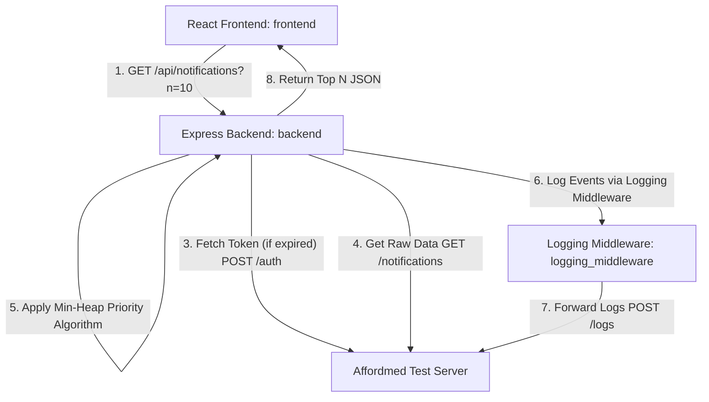

# Stage 1: Notification System Design

## 1. Problem Statement
The campus notifications application has a high volume of updates across different categories. As a result, students lose track of critical updates. To solve this, we introduce a **Priority Inbox** that extracts and displays the top `n` (default 10) most important unread notifications. 

Priority is determined by:
1. **Category Weight:** Placements > Results > Events.
2. **Recency:** If categories are identical, more recent notifications (based on timestamp) take precedence.

Additionally, this solution must process incoming streams of notifications efficiently, utilize a custom reusable logging middleware, and run on a production-ready MERN stack proxy.

---

## 2. Priority Inbox Sorting Logic

### Category Weights
We map each notification type to a numeric priority level:
* **Placement** $\rightarrow$ Weight: `3` (Highest)
* **Result** $\rightarrow$ Weight: `2` (Medium)
* **Event** $\rightarrow$ Weight: `1` (Lowest)
* Any unclassified type $\rightarrow$ Weight: `0`

### Priority Comparison Algorithm
Let $A$ and $B$ be two notifications:
1. Compare their weights:
   * If $\text{weight}(A) \neq \text{weight}(B)$, the one with the higher weight has higher priority.
2. If $\text{weight}(A) = \text{weight}(B)$, compare their timestamps:
   * Parse the timestamps (format: `YYYY-MM-DD HH:MM:SS`) to epoch milliseconds.
   * The notification with the larger (more recent) timestamp has higher priority.

---

## 3. High-Efficiency Algorithm: Min-Heap of Size $N$

In a production environment, new notifications continuously stream in. Sorting the entire list of $M$ notifications whenever a query is made is inefficient.

### Naive Approach: Global Sorting
* **Mechanism:** Fetch all $M$ notifications, sort the entire array using a comparison-based sort (like Timsort/Quicksort), and slice the first $N$ elements.
* **Time Complexity:** $O(M \log M)$
* **Space Complexity:** $O(M)$
* **Drawback:** When $M$ is large (thousands of notifications), sorting the entire list causes high CPU overhead and poor response times.

### Optimized Approach: Min-Heap (Priority Queue)
To keep only the top $N$ notifications efficiently, we maintain a **Min-Heap** of capacity $N$. The heap stores the highest priority items found so far, with the **lowest priority** (weakest link) item at the root.

* **Mechanism:**
  1. Initialize an empty Min-Heap of maximum capacity $N$.
  2. For each notification in the stream of size $M$:
     * If the heap contains fewer than $N$ items, push the item: $O(\log N)$
     * If the heap is full, compare the current item with the root of the heap:
       * If current item has **higher priority** than the root, replace the root with the current item and heapify down: $O(\log N)$
       * Otherwise, discard the current item: $O(1)$
  3. Once all $M$ items have been processed, the heap contains the exact top $N$ notifications. We extract the items and sort them descending (highest priority first): $O(N \log N)$.

#### Complexity Analysis
* **Time Complexity:** $O(M \log N)$
  * Since $N = 10$, $\log_2(10) \approx 3.32$ (constant).
  * The time complexity is effectively linear $O(M)$ relative to the size of the incoming stream. This is significantly faster than $O(M \log M)$ when $M$ is large.
* **Space Complexity:** $O(N)$
  * We only keep $N$ items in memory inside the heap, making the memory footprint extremely small and constant.

---

## 4. System Architecture

### Components
1. **`logging_middleware`**: A reusable, standalone package developed in JavaScript. It enforces strict parameter constraints (verifying `stack`, `level`, and `package` values) and uploads logs to the Test Server.
2. **`backend`**: An Express server. It handles authentication (caching JWTs to reduce roundtrips), proxies request fetching, sorts notifications using the Min-Heap algorithm, and uses the logging package to log route lifecycles.
3. **`frontend`**: A React application built with Tailwind CSS and Vite. It provides a real-time dark-mode dashboard allowing students to filter feed sizes ($n$), reset read states, and instantly mark notifications as read.
